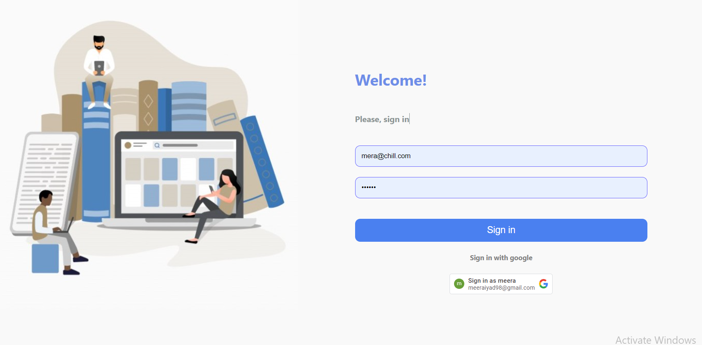
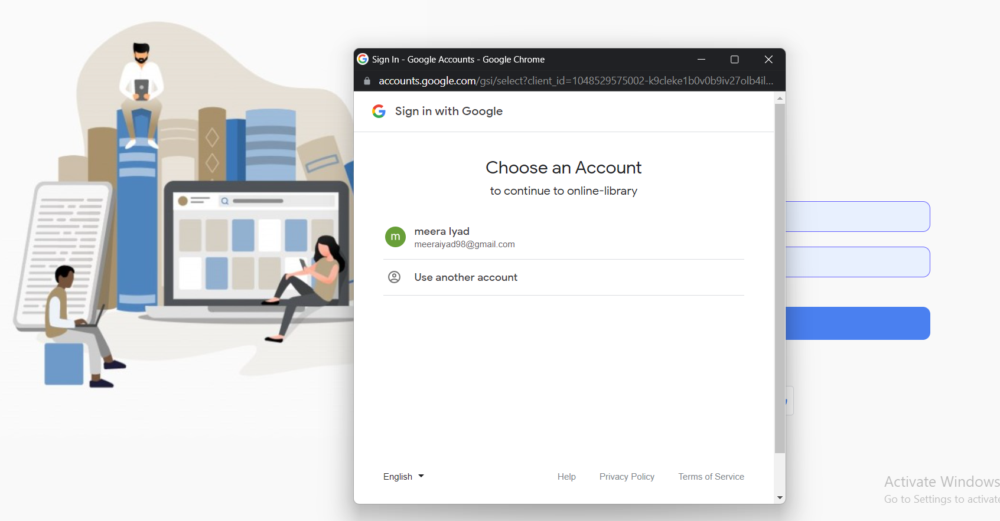
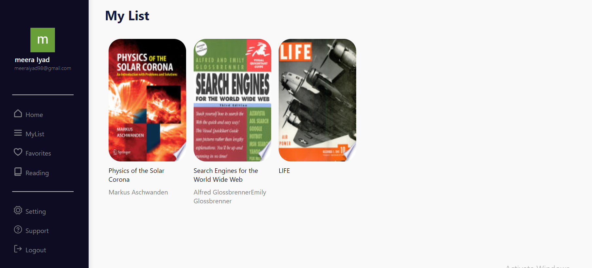

# Online Library

An application that allows users to look up books and add favorite books to their library

The users can sign in by their google account

Home page contains published books , a navbar to give the user the ability to search for any published book using title.

when the user clicks on a book card, a book description will appear on the right side of the page.

The user can add book to his/her library

##Installation and Setup Instructions

To clone down this repository. You will need node and npm installed globally on your machine.

**Installation:**

npm install

**To Run Test Suite:**

npm test

**To Start Server:**

npm start

**To Visit App:**

localhost:3000/library